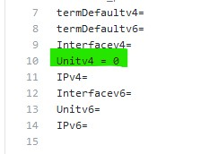
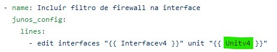

# Antispoofing
Scripts para automação do Antispoofing em CPE´s e PE´s em Juniper

### Completar as variáveis em vars/main.yaml de acordo com seu ambiente (exemplo)

Unitv4 = Colocar 0 ao usar unit 0:

Para completar as variáveis da task:

